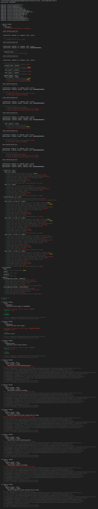

# Craider RAID Token

This is implementation of ERC20 RAID token.

Implementation supports also following protections:

* Freeze and UnFreeze transfers

* Short address protection

* Claim tokens

## Implementation

The RAID token system is implemented using Solidity, the most widely used high level language targeting the EVM. 

### Test Results

Following is test results that we have

### Integration of the token-test-suite -> https://github.com/CryptoverseRocks/token-test-suite

*in case of using cmd on Windows make sure to use "truffle.cmd" instead of just "truffle" commant!
  1. Clone this https://github.com/CryptoBlockTeam/Craider-ICO to your local machine
  2. Make sure you have Python 2.7 installed
  3. Run "npm install"
  4. Check your "truffle-config" to make sure you are using the proper network
  5. Make sure your truffle workspace is working, such as "truffle test contract" command
  6. npm install --save-dev token-test-suite
  7. npm install chai
  8. npm install chai-bignumber
  9. Run "truffle.cmd test ./test/CraiderToken.erc20.js"
  

## Authors

#### Copyright © 2018 Craider Technologies.
